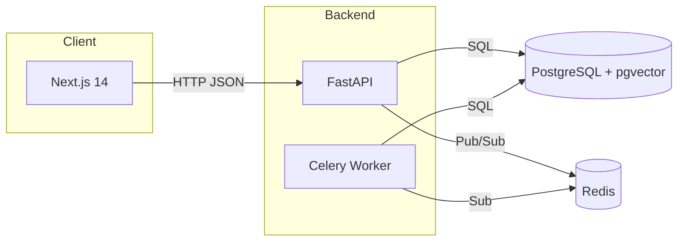

# System Architecture

- Backend: Python 3.11 FastAPI for HTTP API, Celery worker for async tasks
- Database: PostgreSQL 15 with pgvector extension (reason: single operational surface, strong consistency, ACID; chosen over Qdrant to reduce complexity)
- Cache/Queue: Redis 7 for Celery broker/result and rate limiting
- Observability: OpenTelemetry traces to OTLP endpoint; Prometheus metrics at /metrics; JSON structured logs
- Security: JWT auth + RBAC, rate limiting, input validation, audit logs