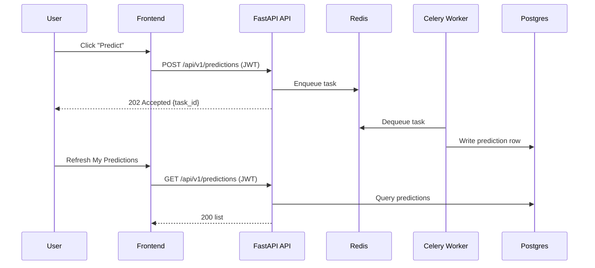

# Sequence Diagrams

```mermaid
sequenceDiagram
  participant U as User
  participant FE as Frontend
  participant API as FastAPI API
  participant R as Redis
  participant W as Celery Worker
  participant DB as Postgres

  U->>FE: Click "Predict"
  FE->>API: POST /api/v1/predictions (JWT)
  API->>R: Enqueue task
  API-->>U: 202 Accepted {task_id}
  W->>R: Dequeue task
  W->>DB: Write prediction row
  U->>FE: Refresh My Predictions
  FE->>API: GET /api/v1/predictions (JWT)
  API->>DB: Query predictions
  API-->>FE: 200 list
```